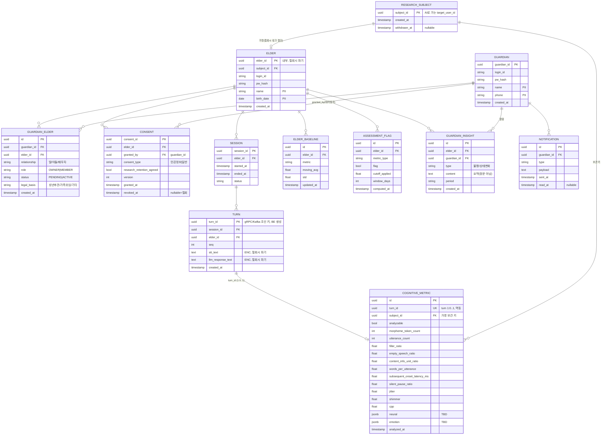

# Wilson ERD v1 (Phase 0)

> BE(Spring Boot·PostgreSQL) 데이터 모델. BE RDBMS = 원본(실 PII). **AI엔 가명 `subject_id`만** 흘러가고, `turn_id`가 gRPC 대화 ↔ Kafka 인지지표의 조인 키다.
> 연구 보관·삭제 정책은 [research-retention.md](research-retention.md) 참조.

## 엔티티 요약 & 보관 정책

| 엔티티 | 역할 | 철회 시 |
|---|---|---|
| **research_subject** | 연구용 가명 키. AI `target_user_id` = 이 값 | **보관** (링크만 절단) |
| **elder / guardian** | 계정(각자 로그인) + PII | elder **파기** |
| **guardian_elder** | N:M 관계 + 권한. OWNER/MEMBER·PENDING/ACTIVE, 첫 링크=OWNER, 이후 OWNER 승인 | **파기** |
| **consent** | 민감정보 대리동의(보호자 근거), 연구보관 동의 | **파기** |
| **session / turn** | 대화 원본(STT+LLM). turn 텍스트 ENC | **파기** |
| **cognitive_metric** | 턴 단위 인지지표(수치). turn_id UNIQUE(멱등), neural/emotion JSONB | **보관** (subject_id) |
| **elder_baseline** | 개인별 동적 baseline(cut-off 상대판정용) | 파기 |
| **assessment_flag** | BE 누적·N일 연속 판정 결과 | 파기 |
| **guardian_insight** | elder→guardian 가공본(원문 노출 금지) | 파기 |
| **notification** | 보호자 푸시 | 파기 |

## 핵심 설계 결정 (요약)
1. **두-tier 신원**: `research_subject`(가명, 보관) ↔ `elder`(PII, 파기). AI는 subject_id만.
2. **N:M + 승인**: guardian_elder role/status, 첫 보호자=OWNER, 이후 OWNER 승인. 마지막 OWNER unlink 금지(소유권 이전 강제) + 고아 시 유예 후 파기.
3. **대리동의 법적 근거**: consent.granted_by + legal_basis. 유효성은 [자문 필요].
4. **조인 키**: turn_id(BE 생성) — 대화·지표 조인. metric은 turn 1:0..1 + turn_id UNIQUE(Kafka 멱등).
5. **암호화**: turn 텍스트 at-rest 암호화(MVP: 볼륨/TDE → 후에 컬럼암호화 승격).
6. **삭제/보관**: 철회 = PII·원문·임베딩·매핑 cascade 파기, 지표는 subject_id로 가명 보관(연구·통계, PIPA 가명정보 특례). rolling-window(M)은 ChromaDB 캐시 정리(별개).
